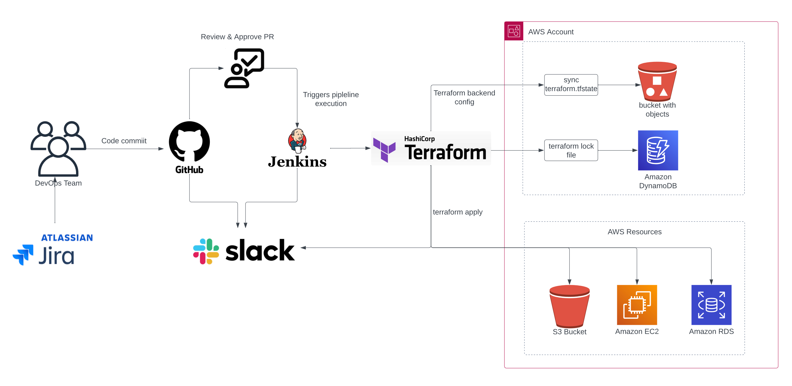

# ci-cd-project-1

# Jenkins Pipeline for Terraform deployment in AWS 

## Overview!

This Jenkins pipeline script automates the Terraform deployment process with manual Git Pull Request approval steps and Slack notifications.

## Prerequisites

- Jenkins configured with the necessary plugins
- Terraform installed on the Jenkins machine
- AWS credentials stored in Jenkins (credentials IDs: aws-dev-user, aws-prod-user)
- Slack integration for notifications

## Pipeline Steps

### 1. Checkout

- Clones the repository to the Jenkins workspace.

### 2. Terraform Init

- Initializes Terraform, answering "yes" to the state migration prompt.

### 3. Terraform Select Workspace

- Determines the Terraform workspace based on the Git branch.
- Checks if the workspace exists, creates it if not, and selects the workspace.

### 4. Terraform Plan

- Runs the Terraform plan command, generating an execution plan.

### 5. Manual Approval

- Pauses the pipeline, awaiting manual approval before proceeding.

### 6. Terraform Apply

- Applies the Terraform plan automatically on approval.
- Notifies Slack about the successful apply.

### Post-Build Actions

- Sends Slack notifications for build completion, failure, unstable builds, and aborted builds.
